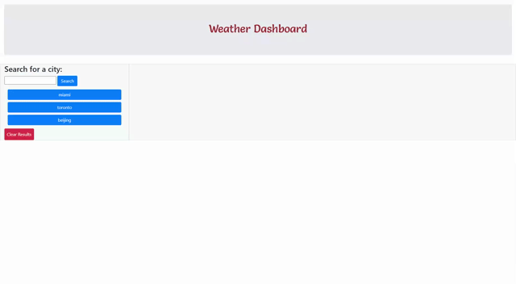

# Weather Dashboard

This is a weather dashboard where a user can check the weather outlook for multiple cities. When a user searches for a city, the city name, date, icon of the weather condition, temperature, humidity and uv index are displayed, along with a 5 day forecast. When multiple cities are searched, the user is then able to go back to the search history and select the previously searched cities to have its respective current and future conditions displayed.

### Prerequisites

There are no prerequisites to run this website. 

### Gif Demo
Below is a demonstration of the Weather Dashboard app in use.

## Built With

* [HTML](https://developer.mozilla.org/en-US/docs/Web/HTML)
* [CSS](https://developer.mozilla.org/en-US/docs/Web/CSS)
* [Javascript](https://developer.mozilla.org/en-US/docs/Web/JavaScript)

## Deployed Link

* [See Live Site](https://dazedchou.github.io/Weather-Dashboard/)

## Authors

* **David Chou** 

- [Link to Portfolio Site](https://dazedchou.github.io/My-Portfolio/)
- [Link to Github](https://github.com/)
- [Link to LinkedIn](https://www.linkedin.com/)

## License

This project is licensed under the MIT License 
